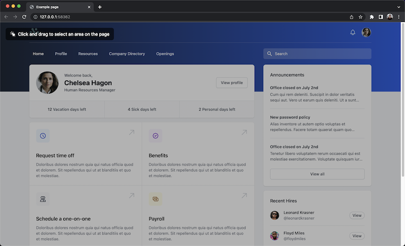
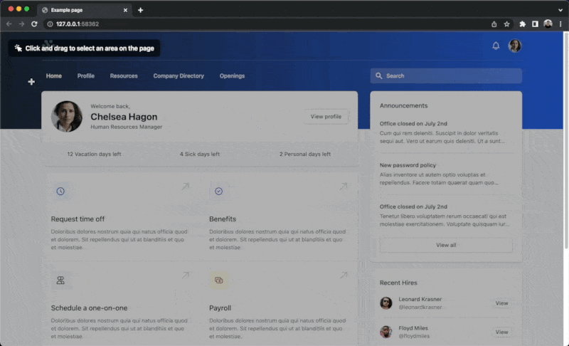
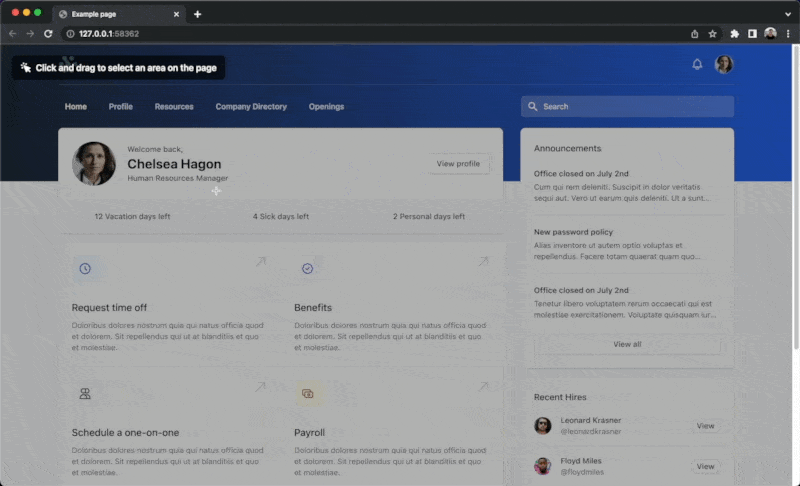

# Technical Test

To get started with the technical test clone this repo and modify the code as per the instructions below. Once you are completed please add the repository to a ZIP file and send it to us via email.

In this repository there is a [example web page](index.html), your task is to modify the [script file](script.js) and make this example web page interactive in several ways:

1. Show an overlay that covers the page, and ask the user to click and drag *(note: the screenshots are for rough guidance and don't need to be copied exactly)*

2. Allow the user to draw a box on the page that removes part of this overlay

3. Determine the largest element that is contained within the area that the user has drawn and add a red outline to that element *(hint: `document.elementsFromPoint` and `IntersectionObserver` are two APIs you can use to help determine what elements are in given area)*

